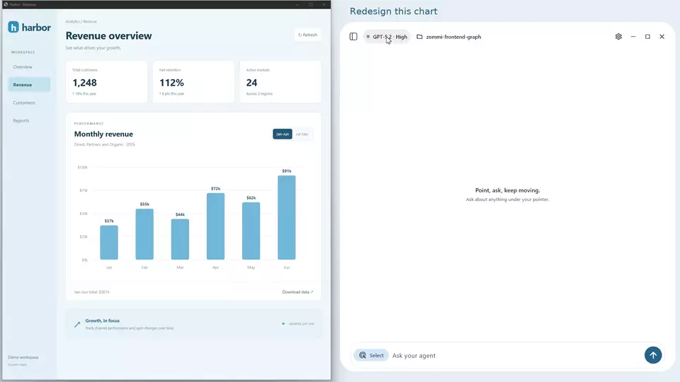

<picture>
  <source media="(prefers-color-scheme: dark)" srcset="design/focalet-logo/exports/ocean/lockup-dark.png">
  
</picture>

# Give your agent the context on your screen

Select what matters, add a sketch, and share the images with available text,
links and UI structure. Focalet brings visual context to the tools you already
use, with an optional desktop app for managing agent conversations.

[Documentation](https://timctho.github.io/focalet/) · [Releases](https://github.com/timctho/focalet/releases) · [Build from source](CONTRIBUTING.md)

## Choose your workflow

| | Focalet Capture | Focalet Desktop |
| --- | --- | --- |
| Use it for | Adding screen context to your existing editor, terminal or chat app | Managing agent chats, saved sessions, models and attachments in a dedicated window |
| Examples | Show Cursor a UI bug; paste a chart into ChatGPT; give a terminal agent several annotated regions | Switch between project conversations; review captured attachments; respond to agent approvals |
| Setup | No agent connection or sign-in in Capture | Connect an installed agent and use its existing account |
| Platforms | Windows, macOS and Ubuntu GNOME Wayland | Windows, macOS and Ubuntu GNOME Wayland |

### Download

| Platform | Focalet Capture | Focalet Desktop |
| --- | --- | --- |
| Windows 10/11 · x64 | [Windows setup](https://github.com/timctho/focalet/releases/download/v0.3.1/Focalet-Capture-Setup-x64.exe) | [Windows setup](https://github.com/timctho/focalet/releases/download/v0.3.1/Focalet-Setup-x64.exe) |
| macOS 12+ · Apple Silicon | [Apple Silicon DMG](https://github.com/timctho/focalet/releases/download/v0.3.1/Focalet-Capture-macOS-arm64.dmg) | [Apple Silicon DMG](https://github.com/timctho/focalet/releases/download/v0.3.1/Focalet-macOS-arm64.dmg) |
| macOS 12+ · Intel | [Intel DMG](https://github.com/timctho/focalet/releases/download/v0.3.1/Focalet-Capture-macOS-x64.dmg) | [Intel DMG](https://github.com/timctho/focalet/releases/download/v0.3.1/Focalet-macOS-x64.dmg) |
| Ubuntu 24.04 · x64 · GNOME Wayland | [Ubuntu package](https://github.com/timctho/focalet/releases/download/v0.3.1/Focalet-Capture-Ubuntu-amd64.deb) | [Ubuntu package](https://github.com/timctho/focalet/releases/download/v0.3.1/Focalet-Ubuntu-amd64.deb) |

Install either app independently. Capture runs from the system tray or menu bar;
Desktop opens an agent workspace. All downloads above are **v0.3.1**.

## Capture: stay in the tool you know

1. Press **Shift+Alt+A** (**Shift+Option+A** on Mac) in the source window.
2. Select and annotate up to eight regions. **Ctrl-drag** enters continuous
   selection; choose a drawing tool or region letter when ready to annotate.
3. Finish the capture, click the destination input, and press **Alt+A**.

Paste follows **image A → context A → image B → context B**. Each image stays
separate at its original dimensions. Context includes available DOM or native
accessibility details; inputs that ignore images still receive text.

The batch remains ready for another deliberate paste. Successful pastes finish
silently. The receiving app controls image support and attachment placement.

Capture does not need an agent account or Desktop. Its tray menu provides capture,
copy, text-only paste and slower image paste controls.

## Desktop: one place for your agent conversations

Connect Codex, Claude Code, OpenCode, Gemini CLI, Hermes, OpenClaw or Pi. Choose
among the models and commands each runtime exposes, manage sessions, and keep
separate drafts and attachments for each chat.

Press **Alt+A** (**⌥ A** on Mac) to select and annotate screen regions, then review
the attachments in your draft before sending. The selected agent owns
credentials, tools, permissions and canonical history.

[Runtime support and setup](docs/install.md#2-choose-the-agent-you-already-have) ·
[Runtime commands](docs/runtime-commands.md) · [Chrome and Edge context](docs/guides/chrome-edge.md)

### See visual context in action

Sketch a chart redesign, compare separate product listings, or select the part
of a dashboard that needs investigation.

[Watch the chart demo](docs/demos/frontend.mp4) · [More recorded examples](docs/demos/README.md)

These historical recordings preserve their original UI and source provenance;
current builds display Focalet.

## What gets shared

Capture starts when you invoke it. Selected pixels are retained; browser or
accessibility context is added only when available and reliably aligned.
Otherwise the selection is marked **Image only** with an explanation.

Review what you share: source metadata can extend beyond the selected pixels.
The receiving app or selected agent's provider policies apply.
[Capture limits](docs/browser-context.md) · [Privacy](docs/privacy.md)

Desktop's **Full access (YOLO)** setting is on by default. Turn it off to follow
each agent's permission policy and display its approval requests.
[Agent permissions](docs/install.md#2-choose-the-agent-you-already-have)

## Develop Focalet

Both apps live in this repository, with separate entrypoints, packages and CI
lanes. They share native capture components. Desktop adds Flutter and the Rust
agent broker; Capture owns its tray, hotkeys and clipboard flow.

[Contributing](CONTRIBUTING.md) · [Component map](docs/desktop-reference.md) ·
[Product use cases](docs/products.md) · [Brand assets](design/focalet-logo/README.md)

Focalet is licensed under [Apache 2.0](LICENSE).
[Third-party notices](THIRD_PARTY_NOTICES.md) · [Security](SECURITY.md) ·
[Code signing](docs/code-signing.md)
