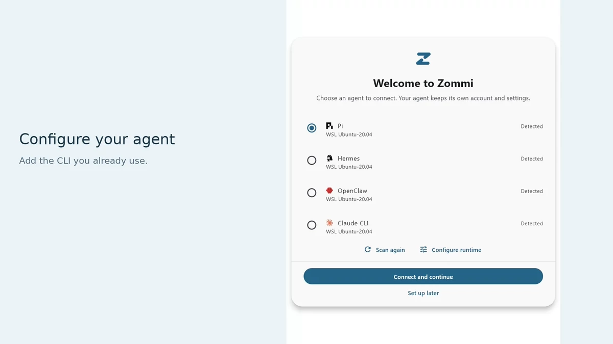
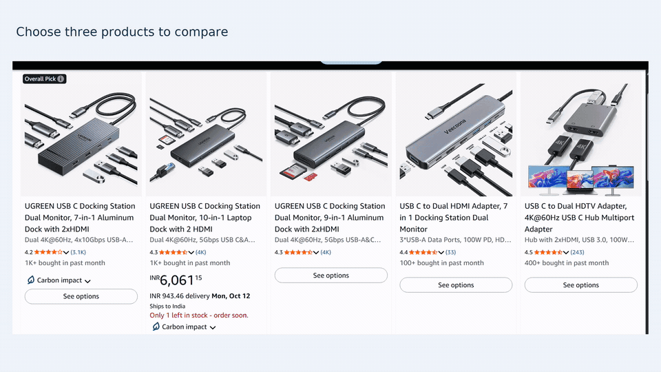
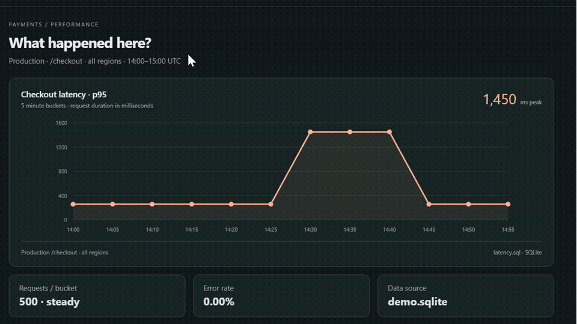
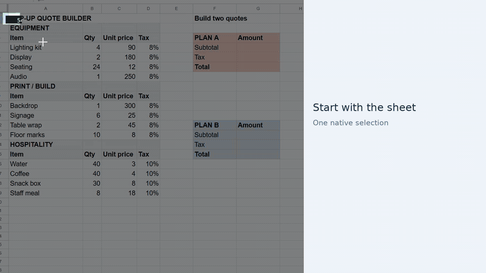

<picture>
  <source media="(prefers-color-scheme: dark)" srcset="design/zommi-logo/exports/ocean/lockup-dark.png">
  
</picture>

# Show your agent what you mean.

**Select it. Ask. Keep going.** Zommi connects what you see on screen to your
existing agent. Select a region, add a sketch if useful, and send the image with
available text, links and structure.

### [Download the latest release →](https://github.com/timctho/zommi/releases)

Uses your existing agent account. [Installation guide](docs/install.md) ·
[Build from source](CONTRIBUTING.md)

## Connect your agent

Choose an installed agent, or use **Configure runtime → Add runtime** to add a
CLI. Repeat for additional runtimes, connect, then choose a model from the chat
header. Sign in through your agent's own flow if needed.

| Agent | Support |
| --- | --- |
| **Codex** | Chats, images, saved sessions, models, approvals and native skills |
| **OpenCode** | Chats, images, saved sessions, models, approvals and advertised commands through ACP |
| **Pi** | Chats, images, models and runtime commands through RPC |
| **Hermes** | Chats and commands exposed by its ACP or Gateway profile |
| **OpenClaw** | Chats and commands exposed by its ACP or local Gateway configuration |
| **Claude CLI** | Text-only terminal compatibility; image attachments unsupported |

## See it in action

Animated previews play automatically; click one for the clearer video.

### Compare three products

Hold **Ctrl** while drawing three separate boxes, one per product, then attach
them together. Each selection keeps its own product link.

> Which of these three would let my M1 MacBook Air run two independent monitors?
> Check the exact listings.

### Investigate a latency spike

Select the interval that looks wrong. This chart exposes its query and data
points, giving the agent context to investigate the source database.

> Why did latency spike here? Check the underlying query and source data.

### Sketch two quotes across a sheet

Use the **Pen** to loop items across three tables, connect them to two quote
boxes, and cross out an option. The agent turns the sketch into linked formulas.

> Turn my sketch into the two quotes. Each loop feeds the box it points to;
> skip the crossed-out option. Link to source cells and calculate subtotal,
> tax and total. Leave source data alone.

## Capture and share

Press **Alt+A**, select a region, review the attachment and ask your question.
On Windows, use the drawing toolbar to annotate or add more regions, then press
**Attach**. Multiple attachments keep their **A**, **B**, **C** references.

On Windows, Ubuntu X11 and macOS, attachments can include source identity, text, links, element
structure and coordinates through accessibility and an optional authorized
browser connection. When reliable alignment is unavailable, Zommi attaches
**Image only** with an explanation.

Capture happens when you invoke it. Review what you share: source metadata can
extend beyond the selected pixels. Your selected agent's provider and data
policies apply. [Capture controls and limitations](docs/browser-context.md)

## Platforms

| Platform | Availability | Capture support |
| --- | --- | --- |
| **Windows 10/11 · x64** | Preview installer | Multiple regions, drawing, accessibility and optional browser context |
| **macOS 12+ · Apple Silicon / Intel** | `.dmg` when listed in a release | Multiple regions, drawing, native Accessibility and optional browser context |
| **Ubuntu 24.04 LTS · x64 · X11** | `.deb` when listed in a release; [install and test](docs/ubuntu-testing.md) | Multiple regions, drawing, AT-SPI and optional browser context |
| **Ubuntu 24.04 LTS · x64 · Wayland** | Experimental; requires compatible desktop portals | Portal images and drawing; no aligned DOM/accessibility; shortcuts depend on the desktop |

Linux support is limited to Ubuntu. Start with **Ubuntu on Xorg** for desktop testing.

[Releases](https://github.com/timctho/zommi/releases) ·
[Installation and permissions](docs/install.md) ·
[Contributing](CONTRIBUTING.md)

## License

Zommi is licensed under [Apache 2.0](LICENSE).
[Third-party components](THIRD_PARTY_NOTICES.md) retain their respective licenses.
