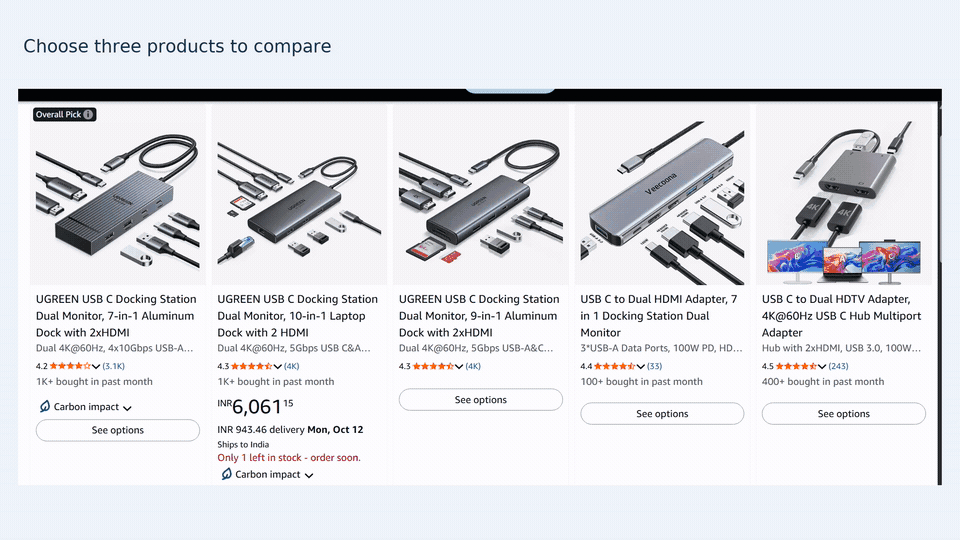
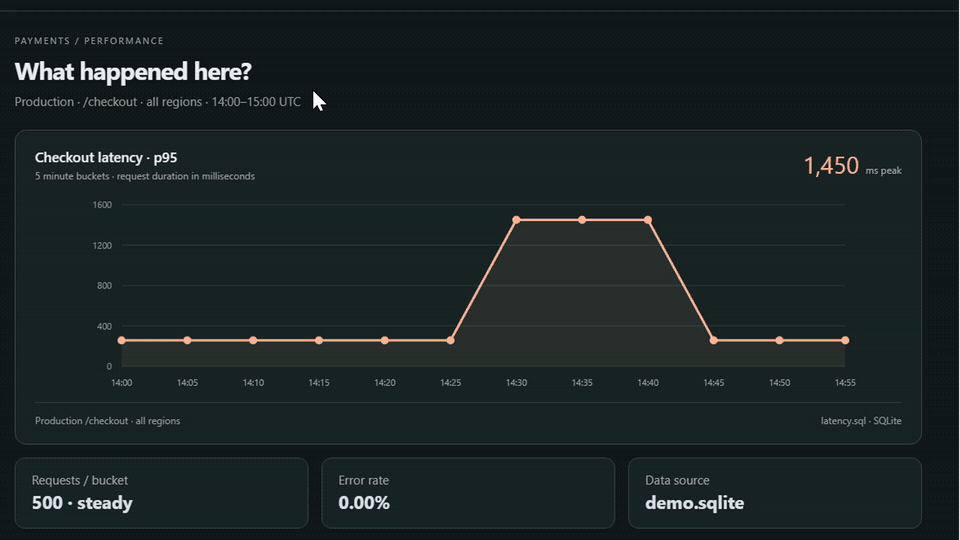
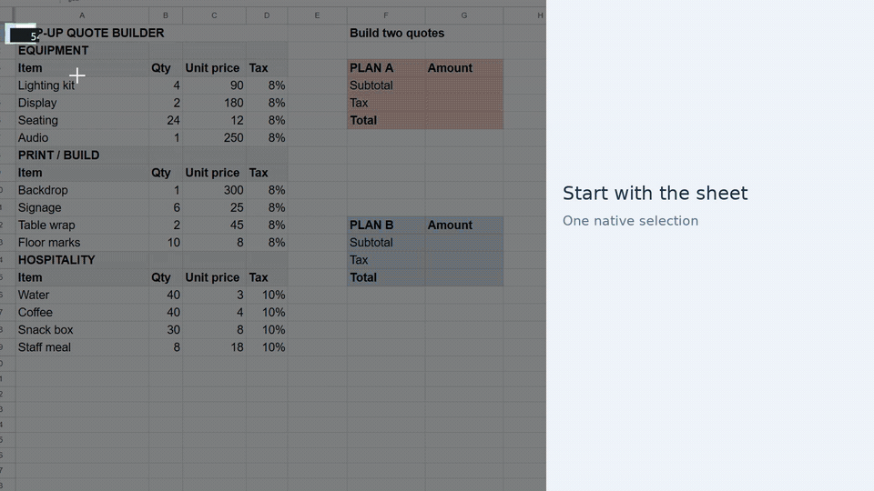

# See what you can stop describing

Three native Windows recordings start with context that is tedious to explain:
a row of similar products, one spike inside a dashboard, and loosely selected
spreadsheet cells. Quick selections and prompts lead to actual agent results.

## 1. Amazon: one box around all the candidates

On the real listing grid, select the whole row once. Ask:
**“Which of these would let my M1 MacBook Air run two independent monitors?
Check the exact listings. Keep the comparison short and link the sources.”**

The single native attachment retains all five product links. The agent reads
every exact listing and checks Apple's display limit. Its sourced comparison
finds that **none of the five supports two independent external displays on the
M1 Air**, despite their dual-HDMI descriptions. No purchase is made.

[](amazon.mp4)

[Watch · 29 seconds](amazon.mp4) · [View the comparison](amazon-poster.webp)

## 2. Dashboard: just this latency spike

Select only the spike's interval, leaving Query Inspector outside the rectangle.
Ask: **“Why did latency spike here? Check the underlying query and source data.
Give me the cause and strongest evidence in 3 short bullets.”**

One native attachment carries the full executed SQL and the **14:30, 14:35 and
14:40 UTC** points. The agent runs the query and investigates the synthetic
source records: p95 rises **256 → 1,450 ms** after an inventory-pool reduction in
one region; recovery follows restoration of that setting. Volume and comparison
traffic stay steady. The source database and query remain unchanged.

[](dashboard.mp4)

[Watch · 26 seconds](dashboard.mp4) · [View the analysis](dashboard-poster.webp)

## 3. Sheets: A and B get different layouts

Loosely frame the budget block as **A** and the schedule block as **B**. Ask:
**“Make A compact with navy headers. Make B spacious with orange headers,
taller rows and larger text. Keep values and formulas.”**

The two references receive visibly different treatments: A becomes a compact
navy table; B becomes a roomy orange agenda with larger text and taller rows.
The agent uses the captured context to apply each instruction to the right
block. The prompt supplies no table names, cell addresses or document URL.

The clip ends with an enlarged view of both layouts; editorial A/B labels
identify the recorded areas. Authenticated workbook
readbacks verify the styles on A and B separately and preserve every value and
formula, including the other tabs.

[](sheets.mp4)

[Watch · 23 seconds](sheets.mp4) · [View both layouts](sheets-poster.webp)

## What was recorded

Recorded September 20, 2026 with the native Windows app and a real Codex runtime.
Amazon uses signed-out public product pages; listings and availability can
change. The dashboard and private Google Sheet contain synthetic data.

Selections, prompts, agent replies and sheet edits are real. The edited clips
shorten setup and waits, accelerate gestures and typing, and use five-second
labelled context illustrations. Results retain reading time. There is no audio
or scripted agent response. Discarded capture attempts are omitted.

Sheets uses two selections in a single request. Both the source selections and
the completed live layout come from the same native take and agent session.

The sample dashboard explicitly exposes its executed SQL through the chart's
standard accessibility description. Zommi captures that description and the
spatially selected points; Query Inspector is not selected. This demonstrates
an application that exposes query context, not recovery of arbitrary hidden
queries. The agent already has access to the sample database workspace.

The Amazon grid's DOM traversal is truncated, but all five candidate links are
retained; the agent reads full product details with browser tools. Sheets uses
native Windows accessibility, retaining document identity with a truncated
traversal; the agent reads and edits the actual cells through its browser tools.
Zommi supplies context, while the existing agent supplies the tools and access.

All final MP4/GIF/poster frames are decoded and scanned with OCR. Edited
sequences and media metadata are reviewed, and the [manifest](manifest.json)
records exact published hashes and the actual Windows recording build. Raw
captures, profiles, session transcripts, workbook receipts and OCR text remain
private. The source sheet URL is not published.

## Reproduce and verify

See the [recording brief](../../scripts/demo/SCENARIOS.md),
[latency storyboard](../../scripts/demo/DASHBOARD-STORYBOARD.md), and
[sheet fixture](../../scripts/demo/sheets/README.md). Use a fresh recording
profile and verify browser access before recording. Capture through the native
app, inspect the actual attachment source, and keep account chrome out of crops.

Proof guards require completed agent sessions, real tool activity and source
readbacks before generating the illustrations. The dashboard guard also rejects
missing query metadata or points outside the selected interval. The Sheets guard
checks each reference's color, row height and font size, and unchanged values
and formulas. Matching or swapped styles fail this scenario.
Timing markers alone do not prove that a capture or edit succeeded.

```sh
python3 scripts/demo/review-export.py \
  /private/output/demo.mp4 /private/output/demo.gif /private/output/demo-poster.webp \
  --output /private/output/review \
  --forbid-file /private/account-and-project-names.txt
python3 -m unittest discover -s tests -p 'test_demo*.py' -q
python3 scripts/verify_demo_assets.py
```

Keep the forbidden-name list and OCR output private. Combine OCR with visual
and source review, and update the manifest only after the exact bytes pass.
