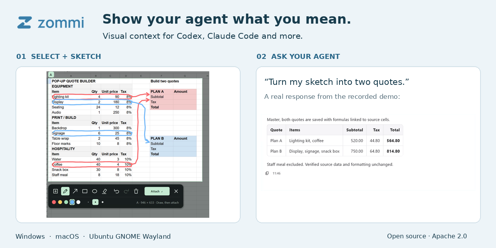

# Zommi — visual context for AI agents

**Show your agent what you mean.** Zommi is an open-source desktop companion for
Codex, Claude Code and other AI agents. Select and annotate a screen region,
review the attachment, and ask your question with available text, links and structure.

[Download Zommi](https://github.com/timctho/zommi/releases/latest){ .btn .btn-primary }
[Get started](install.md){ .btn .btn-outline-primary }

## Select. Attach. Ask.

1. Connect an installed agent runtime and choose a model.
2. Press **Alt+A** (**⌥ A** on Mac), select a region, and annotate it if useful.
3. Attach the selection to your draft, review it, and send your question.

Use your existing agent account. Zommi supports Windows 10/11 x64, macOS 12+
on Apple Silicon and Intel, and Ubuntu 24.04 GNOME Wayland x64.

## Start with your task

- [Share screenshots and screen context with Claude Code](guides/claude-code.md).
- [Connect Chrome and Edge for browser DOM context](guides/chrome-edge.md).
- [Capture desktop context on Ubuntu Wayland](guides/ubuntu-wayland.md).
- [Learn capture limits and image-only fallbacks](browser-context.md).
- [Understand privacy and agent permissions](privacy.md).

## Work with your existing agents

Zommi connects to Codex, Claude Code, OpenCode, Gemini CLI, Hermes, OpenClaw and
Pi. Features depend on each runtime's protocol. See the
[runtime setup and limitations](install.md#2-choose-the-agent-you-already-have)
and [runtime commands](runtime-commands.md).

## Build and contribute

The project uses Flutter for the desktop UI, Rust for the agent broker, and
native capture helpers. Start with the [contributor guide](../CONTRIBUTING.md),
[component map](desktop-reference.md) or [repository instructions for coding agents](../AGENTS.md).

Zommi is licensed under [Apache 2.0](../LICENSE).
[Code signing policy](code-signing.md) · [Security policy](../SECURITY.md)
